layout: post
title: "Litige avec Chip'n Modz – Un écran PSVita "neuf & original" qui s'avère être une contrefaçon dangereuse"
date: 2026-08-07
categories: [hardware, modding, litige]
---

## Contexte

Passionné de rétro-ingénierie et de développement sur console portable, j'ai récemment acheté un écran AMOLED complet pour PSVita 1000 sur le site Chip'n Modz. Le produit était décrit comme **"neuf & original"**,
avec une photo montrant les deux bagues chromées sous les joysticks. Je précise que j'ai acheté cette PSVita quelques jours avant cette infamie sur LeBonCoin, j'ai fait cette acquisition pour faire du développement 
sur la bête, j'ai donc décidé de remettre la batterie a neuf et de changer le port USB Sony standard par un mod USB-C, Data + et - compris ( je posterais le taf sur un prochain poste et y mettrais un lien pour les curieux 😉), puis cet écran ! Je comptais changer les joysticks mais je n'ai malheureusement rien trouvé de convaincant pour le moment . Les éléments tel que la batterie et le mod USB-C ont tout deux été acheter 
dans des enseignes différentes, ils ne proviennent nullement de chez Chip'n Modz !

**Commande passée le :** [2026/26/07] 

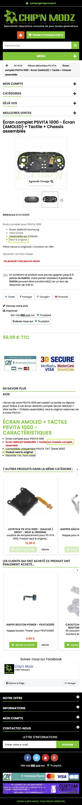

**Prix :** 64,99 € (59,99 + 5 € de port)

---

Une nouvelle photo du site de ces pro' a deux mains gauches,
**la bague y est bien présente !**... La blague aussi ! 😁 (cette dernière photo n'a pas été ajouté par la suite, mais est du a une conversion du site entre laptop/desktop et smartphone)

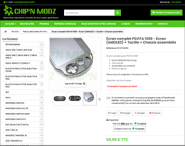

---

## Ce que j'ai reçu

Dès l'ouverture du colis, j'ai constaté plusieurs anomalies :

### 1. Absence des bagues chromées

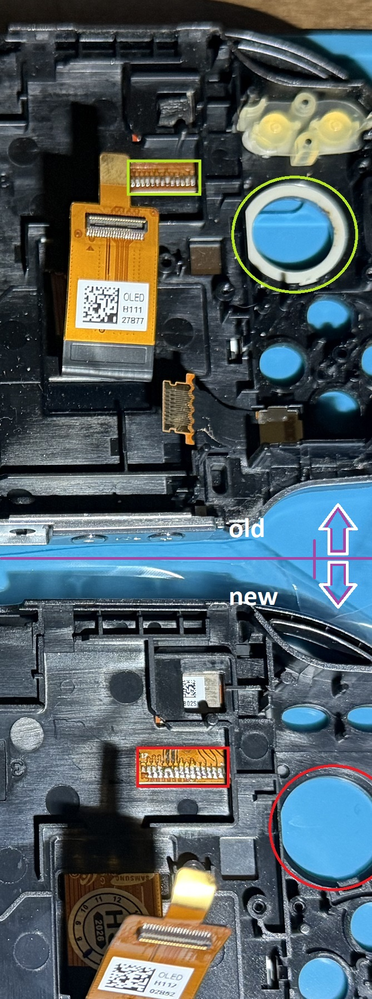

-Mesure du diamètre (bagues en place) au PAC de mon ancien écran :

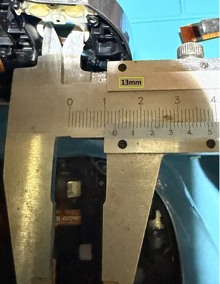 

-Mesure du diamètre (bagues manquantes) au PAC de l'écran neuf :

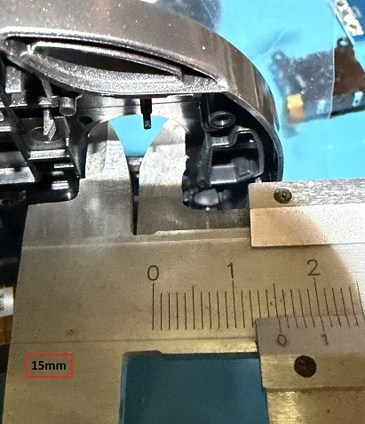  
*Photo de l'écran reçu – les bagues sont absentes, contrairement à la photo du site.*

### 2. Soudure de la nappe amateur

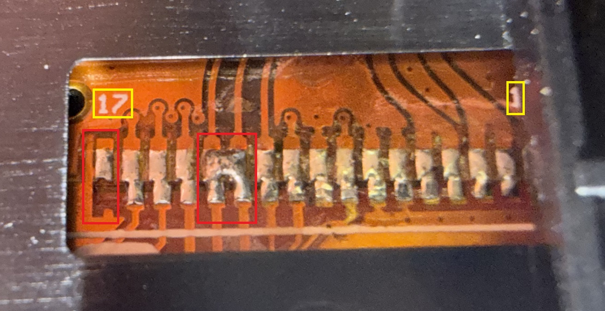  
*La nappe est brasée manuellement, avec un décalage d'environ 0.4 mm. Du flux non nettoyé est encore présent.*
*Remarquez aussi l'ajustement de la nappe interne, celle de l'écran et non celle en sortie qui se connecte a la carte mère, 
sur le coin supérieur droit, vous y voyez légèrement le symbole "1" correspondant a la piste du même chiffre, hors sur l'original 
cet ajustement n'est pas le même, et ne permet pas de visualiser cette indice, et ce détail est bien plus flagrant sur le coin 
supérieur gauche, car il y a un détrompeur ( le petit trou dans la nappe interne ) et celui ci sert de point de fixation pour
les automates qui mettent en approche ce circuit flexible pour permettre un ajustement nette du raccordement de ces 2 nappes,
qui sont par la suite brasées par des machines en série par un processus reflow ou laser, ce qui donne un résultat impeccable
dans sa finalité ! Hors ici tout est bien différent et mal ajusté, signe que ceci n'est pas du travail fait par automatisation !
Ceci est bien visible sur les deux photos si dessous.*

### 3. Défauts critiques détectés au microscope

- **Piste 17 (GND) :** non reliée (piste arrachée).
- **Pistes 12 (SPI_CS) et 13 (INT) :** pontées par un excès d'étain.

  
*Court-circuit visible entre les pistes 12 et 13.*

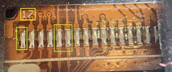 

*Travail fait par les labo de **Sony**, et c'est du **propre**.*

---

### 4. Clarification du matériel 

Ces photos montre une partie de mon setup, ma PSVita et leur écran, pour avoir une vision plus éclairé.

Mon labo, ma PSV et l'écran de la mort qui tue 🤗 :

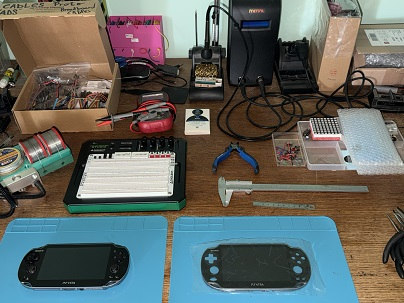 

Mon System PSV vue de près et remonté 😎:

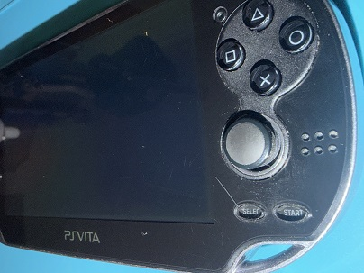  
*Visualisez bien la rayure vers le bouton select, qui fait référence a l'usure temporel de l'engin 😋.*

L'écran de ces professionnel de haute voltige 🙄:

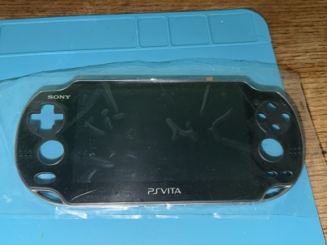 

*Le recto, rutilant et avec la feuille de protection.* 

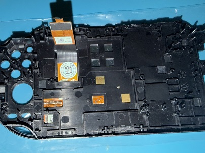 

*Le verso qui pourrait paraitre propre vue d'ici... Mais les photos avec une prise de vue macro démontres le contraire 🧐!*

## Diagnostic technique complet

J'ai utilisé mon **Analog Discovery Studio** pour effectuer des tests de continuité et de court-circuit.

Voici les ref' Pinout pour la nappe : 

| Broches | Signal | fonction |
|---------|--------|----------|
| 1 |	GND |	Masse |
| 2 | AVDD |	Alimentation analogique |
| 3 |	AVDD | Alimentation analogique |
| 4 |	VDD |	Alimentation numérique |
| 5 |	VDD |	Alimentation numérique |
| 6 |	GND |	Masse |
|7 | GND |	Masse |
|8 | SPI_CLK |	Horloge SPI |
|9 | GND |	Masse |
|10 | SPI_MISO | Data SPI (Master In Slave Out) |
|11 | SPI_MOSI | Data SPI (Master Out Slave In) |
|12 | SPI_CS | Chip Select (sélection du composant) |
|13 | INT |	Interruption (signal d'événement) |
|14 | RESET |	Réinitialisation |
|15 | SDA |	I2C Data (ou Data SPI) |
|16 | SCL |	I2C Clock (ou SPI Clock) |
|17 |GND |	Masse |

### Datasheet de l'écran : 

[Télécharger le datasheet complet](images/AMS495QA04_datasheet_V5.pdf) 

### Extrait du datasheet correspondant aux PINs de sortie de la nappe :

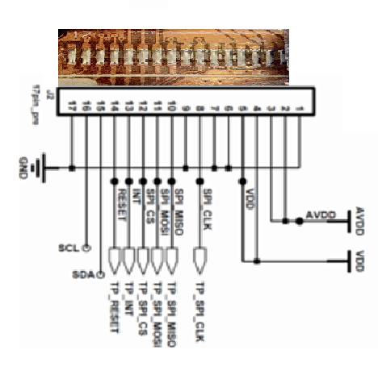 

*La piste n°1 (**GND**) n'est pas visible sur le circuit, car elle est dissimulée sous la coque plastique, mais elle est bien présente !*

---

### Résultats des mesures

| Test | Résultat | Statut |
|------|----------|--------|
| Continuité piste 17 | Coupée | ❌ |
| Court-circuit piste 12-13 | Pont présent | ❌ |
| Absence de bagues | Constaté | ❌ |

### Risque pour la console

- **Le pont entre SPI_CS (broche 12) et INT (broche 13) – LE DÉFAUT MAJEUR**

**SPI_CS** est une ligne active basse : elle est normalement à l'état haut (**VDD**) et passe à l'état bas (**GND**) pour sélectionner le composant et démarrer une communication **SPI**.

**INT** est une ligne d'interruption : elle est utilisée par l'écran pour signaler un événement (tactile, rafraîchissement, etc.) au processeur. Elle est généralement active basse également.

Court-circuiter **SPI_CS** et **INT**, c'est :

Forcer la ligne **INT** en permanence à l'état bas lorsque le bus **SPI** est sollicité (car **CS** passe à 0), ce qui génère des *interruptions fantômes* en continu.

Risquer de bloquer le bus **SPI** car le signal **CS** ne peut plus monter correctement à l'état haut.

Dans le pire des cas, endommager le contrôleur **SPI** du **SoC** de la PS Vita en le soumettant à des *conflits de niveaux logiques*.

En clair : brancher cet écran, c'est mettre le système de communication **SPI** de la console en danger. Le contrôleur **SPI** du **SoC** pourrait griller ou voir ses E/S détruites par des courts-circuits répétés.

De plus les bagues manquantes laissent une porte d'entré a tout éléments volatile (poussières, particules, etc...), ce qui à la longue pourrait provoqué des 
court circuits si mal entretenu.

**J'ai refusé de le brancher** et j'ai contacté le service client.

---

## Échanges avec le service client

Je tiens a signaler que je ne suis pas très sympathique concernant l'acquisition sous contrat de vente, d'objets ou de biens matériels endommagés ou comportant des vices cachés, via les services d'achats en ligne.
Je part du principe que je suis le client et que l'achat doit correspondre en tout points a la description faite par le vendeur, et a ces photos, contractuel ou non !
En revanche je reste toujours ouvert a la discussion et même a l'arrangement, quand bien entendue, le SAV reste correcte ! C'est à dire, que si ceux ci avaient dénié admettre leurs torts, j'aurais tout bêtement réparé ceci et l'affaire aurait été clôturée de suite dans l'état , car je me moque de ces 60€ et des bananes ! 

Voici le résumé des messages (anonymisés pour respecter le secret des correspondances) :

> **Mon premier message (résumée) :**  
> *"Bonjour, j'ai reçu l'écran mais il manque les bagues chromées et la nappe présente des défauts de soudure critiques. Réglez ce litige et vite."*

> **Leur réponse (résumée) :**  
> *"Nos produits sont neufs et originaux, directement issus des usines Sony. Vous devez récupérer les bagues sur votre ancien écran ainsi que les pad thermique. Nous ne remboursons pas les produits endommagés par l'utilisateur."*

> **Mon deuxième message (résumée):**  
> *"J'ai des photos macro des défauts. Une piste est coupée, deux sont pontées. C'est un danger pour la console. Vous dites avoir testé cet écran, mais je sais qu'il est défaillant ! Tout comme le fait que celui-ci sorte des labos de chez Sony, alors qu'il y manque les bagues et que le job est très mal réalisé."*

> **Leur dernière réponse (résumée) :**  
> *"Si vous n'êtes pas capable de retirer de simples bagues, ne vous lancez pas dans la réparation de console."*

Je n'ai pas répondu a leur dernier mail, car ils sont de bien mauvaise foi et me font des éloges sur mes travaux 😂😂😂 ! Considérant que le litige n'est plus une question de blabla, il est temps de montrer a ces amateurs comment on opère sur un circuit 🤗 et ça c'est mon dada... Pas de bol 👹!
---

## Réparation et preuve de l'amateurisme

Plutôt que de renvoyer l'écran (et perdre ma seule preuve), j'ai décidé de le réparer moi-même tout en documentant chaque étape.
Je me moque de leurs 60€, là n'est pas le problème ! C'est la ferveur qu'ils mettent a faire passer les clients pour des navets ! 
Et le souci de dangerosité pour la console qui je le rappel, devait recevoir cet écran pour restauration et non pour détérioration !
J'ai tout simplement un problème avec les gens de mauvaises fois !
Réparons donc cette beauté ☺. 

### Matériel utilisé
- Metcal MX-5000 (station de soudure professionnelle)
- Alcool isopropylique 99%
- Fil de liaison (wire-bonding)

### Étapes de la réparation
1. **Nettoyage** du flux résiduel à l'alcool.
2. **Dépontage** des pistes 12 et 13 avec un fer fin.
3. **Réparation** de la piste 17 avec un fil de liaison.
4. **Contrôle** final avec l'Analog Discovery Studio.

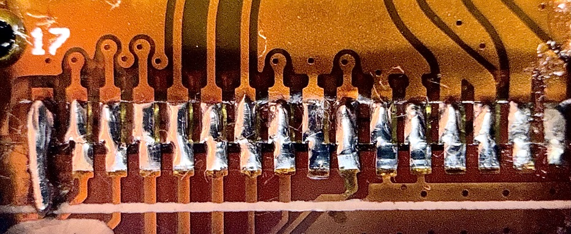  
*La piste 17 réparée avec un fil de liaison – test de continuité OK.
Les pistes n°12 et 13 désolidarisées et remisent au propre – test de continuité OK. 👌*

### Test final
Une fois réparé, et bien que les tests de continuités soient correcte, l'écran n'a pas été branché sur ma PSVita .

Rien ne m'indique que l'écran est pleinement fonctionnel, pour ce faire il faudrait braser des PINs sur les pistes pour faire des testes plus poussés avec l'ADS !
Qu'à cela ne tienne ! Il suffit de finir ce qui a été commencé, non ?!

Posons nos yeux sur le circuit quelques instant, pour détourner les liaisons de celui-ci sur l'ADS et lui donner de quoi faire une analyse précise.
Il nous donnera une vision clair qui me permettra de prendre une décision finale concernant l'essaie sur la carte mère 😉.

Il nous faut éclaircir quelque points avant de démarrer.

---

##Le début de la fin

Cherchons, pour commencer, quelles Pins nous serraient utile pour ces détails finaux.

Voici les 7 connexions indispensables pour une simple initialisation :

| Fonction | Pin Nappe | Branchement sur ADS |
|----------|-----------|---------------------|
|GND	|1 (ou 6/7/9/17)|	GND (alimentation) ET GND (référence oscillo)|
|VDD (logique)|	4 & 5 (souder ensemble)|	V+ (1.8V)|
|AVDD (analogique)|	2 & 3 (souder ensemble)|	V- (3.3V dans un premier temps)|
|SPI_CLK|	8|	Digital I/O 0 (DIO0)|
|SPI_MOSI|	11|	Digital I/O 1 (DIO1)|
|SPI_CS	|12|	Digital I/O 2 (DIO2)|
|RESET|	14|	Digital I/O 3 (DIO3)|
*(Le SPI_MISO pin 10, l'INT pin 13, le SDA/SCL ne sont pas nécessaires pour une simple initialisation. On les ignore pour l'instant.)*

**1. Configuration de l'alimentation**

C'est l'étape la plus critique. Il faut alimenter l'écran avec les bonnes tensions, sans quoi il pourrait être endommager définitivement.

- VDD (pins 4 et 5) : C'est la logique numérique. D'après le wiki de développement, la logique de la PS Vita fonctionne en 1.8V. C'est une valeur très probable pour VDD.

- AVDD (pins 2 et 3) : C'est l'alimentation analogique pour l'OLED. Je n'ai pas de valeur officielle, mais pour des écrans de ce type, c'est souvent autour de +5V à +6V. Je conseille donc de commencer très bas, par exemple +3.3V, et de n'augmenter que si l'écran ne s'allume pas. Ne dépassez pas 6V!

- GND (pins 1, 6, 7, 9, 17) : Toutes les masses doivent être reliées ensemble.

--

**Action :

Nous allons lancer le logiciel WaveForms (c'est lui qui vas nous aider a y voir plus clair), puis utiliser l'instrument "Supplies" (l'alimentation variable).
Il nous faut Configurer une sortie (V+) en tension constante (CV) à 1.8V pour le VDD, puis une autre (V-) à 3.3V pour l'AVDD.
Commençons par Connecter les masses de l'écran (pin 7 était la plus simple de toutes) à la masse (GND) de l'ADS puis connectons les sorties d'alimentation aux pins correspondantes.
Soyons prudent et ne les activons pas de suite (laissons les sorties désactivées pour l'instant).

  
*L'écran réparé en fonctionnement – aucune anomalie.*

---

## Ce que cela m'aurait coûté si je l'avais branché

| Élément | Coût estimé |
|---------|-------------|
| Carte mère PSVita | 140 € |
| Main d'œuvre pour réparation | 50-100 € |
| **Total** | **130-220 €** |

J'ai évité ce désastre grâce à mon expérience et mes outils. Un novice aurait grillé sa console.

---

## Conclusion et avertissement

**Chip'n Modz vend des produits :**
- ❌ Non conformes à la description
- ❌ Dangereux pour le matériel
- ❌ Avec un service client méprisant

**Je ne demande pas de remboursement.** Je veux que la communauté soit informée.

**Si vous achetez un écran chez eux :**
- Testez-le impérativement avec un multimètre avant de le brancher
- Vérifiez la présence des bagues
- Inspectez la nappe à la loupe

**Liens utiles :**
- [Mon avis sur Trustpilot](https://www.trustpilot.com/...)
- [SignalConso – signalement officiel](https://signal.conso.gouv.fr/)

---

*Documenté et rédigé par [Ton Pseudo] – Passionné de rétro-ingénierie depuis 20 ans.*
