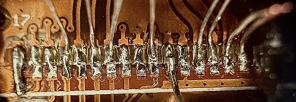
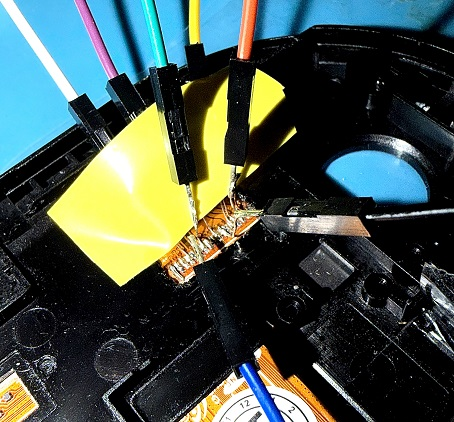
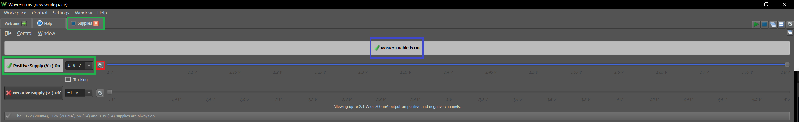

layout: post
title: "Litige avec Chip'n Modz – Un écran PSVita "neuf & original" qui s'avère être une contrefaçon dangereuse"
date: 2026-08-07
categories: [hardware, modding, litige]
---

## Contexte

Passionné de rétro-ingénierie et de développement sur console portable, j'ai récemment acheté un écran AMOLED complet pour PSVita 1000 sur le site Chip'n Modz. Le produit était décrit comme **"neuf & original"**,
avec une photo montrant les deux bagues chromées sous les joysticks. Je précise que j'ai acheté cette PSVita quelques jours avant cette infamie sur LeBonCoin, j'ai fait cette acquisition pour faire du développement 
sur la bête, j'ai donc décidé de remettre la batterie a neuf et de changer le port USB Sony standard par un mod USB-C, Data + et - compris ( je posterais le taf sur un prochain poste et y mettrais un lien pour les curieux 😉), puis cet écran ! Je comptais changer les joysticks mais je n'ai malheureusement rien trouvé de convaincant pour le moment . Les éléments tel que la batterie et le mod USB-C ont tout deux été acheter 
dans des enseignes différentes, ils ne proviennent nullement de chez Chip'n Modz !

**Commande passée le :** [2026/26/07] 

**(Prix :** 64,99 € (59,99 + 5 € de port))

---

Une nouvelle photo du site de ces pro' a deux mains gauches,
**la bague y est bien présente !**... La blague aussi ! 😁 (cette dernière photo n'a pas été ajouté par la suite, mais est du a une conversion du site entre laptop/desktop et smartphone)

*(Encore une preuve que les bagues sont bien présente sur les photos du site !)*
---

## Ce que j'ai reçu

Dès l'ouverture du colis, j'ai constaté plusieurs anomalies :

### 1. Absence des bagues chromées

-Mesure du diamètre (bagues en place) au PAC de mon ancien écran :

 

-Mesure du diamètre (bagues manquantes) au PAC de l'écran neuf :

  
*(Photo de l'écran reçu – les bagues sont absentes, contrairement à la photo du site.)*

### 2. Soudure de la nappe amateur

  
*La nappe est brasée manuellement, avec un décalage d'environ 0.4 mm. Du flux non nettoyé est encore présent.*
*Remarquez aussi l'ajustement de la nappe interne, celle de l'écran et non celle en sortie qui se connecte a la carte mère, 
sur le coin supérieur droit, vous y voyez légèrement le symbole "1" correspondant a la piste du même chiffre, hors sur l'original 
cet ajustement n'est pas le même, et ne permet pas de visualiser cette indice, et ce détail est bien plus flagrant sur le coin 
supérieur gauche, car il y a un détrompeur ( le petit trou dans la nappe interne ) et celui ci sert de point de fixation pour
les automates qui mettent en approche ce circuit flexible pour permettre un ajustement nette du raccordement de ces 2 nappes,
qui sont par la suite brasées par des machines en série par un processus reflow ou laser, ce qui donne un résultat impeccable
dans sa finalité ! Hors ici tout est bien différent et mal ajusté, signe que ceci n'est pas du travail fait par automatisation !
Ceci est bien visible sur les deux photos si dessous.*

### 3. Défauts critiques détectés au microscope

- **Piste 17 (GND) :** non reliée (piste arrachée).
- **Pistes 12 (SPI_CS) et 13 (INT) :** pontées par un excès d'étain.

  
*(Court-circuit visible entre les pistes 12 et 13.)*

 

*(Travail fait par les labo de **Sony**, et c'est du **propre**.)*

---

### 4. Clarification du matériel 

Ces photos montre une partie de mon setup, ma PSVita et leur écran, pour avoir une vision plus éclairé.

Mon labo, ma PSV et l'écran de la mort qui tue 🤗 :

 

Mon System PSV vue de près et remonté 😎:

 

*(Visualisez bien la rayure vers le bouton select, qui fait référence a l'usure temporel de l'engin 😋.)*

L'écran de ces professionnel de haute voltige 🙄:

 

*(Le recto, rutilant et avec la feuille de protection.)* 

 

*(Le verso qui pourrait paraitre propre vue d'ici... Mais les photos avec une prise de vue macro démontres le contraire 🧐!)*

## Diagnostic technique complet

J'ai utilisé mon **Analog Discovery Studio** pour effectuer des tests de continuité et de court-circuit.

Voici les ref' Pinout pour la nappe : 

| Broches | Signal | fonction |
|---------|--------|----------|
| 1 |	GND |	Masse |
| 2 | AVDD |	Alimentation analogique |
| 3 |	AVDD | Alimentation analogique |
| 4 |	VDD |	Alimentation numérique |
| 5 |	VDD |	Alimentation numérique |
| 6 |	GND |	Masse |
|7 | GND |	Masse |
|8 | SPI_CLK |	Horloge SPI |
|9 | GND |	Masse |
|10 | SPI_MISO | Data SPI (Master In Slave Out) |
|11 | SPI_MOSI | Data SPI (Master Out Slave In) |
|12 | SPI_CS | Chip Select (sélection du composant) |
|13 | INT |	Interruption (signal d'événement) |
|14 | RESET |	Réinitialisation |
|15 | SDA |	I2C Data (ou Data SPI) |
|16 | SCL |	I2C Clock (ou SPI Clock) |
|17 |GND |	Masse |

### Datasheet de l'écran : 

[Télécharger le datasheet complet](images/AMS495QA04_datasheet_V5.pdf) 

### Extrait du Datasheet ( Plan en fin de doc ) correspondant aux PINs de sortie de la nappe :

 

*(La piste n°1 (**GND**) n'est pas visible sur le circuit, car elle est dissimulée sous la coque plastique, mais elle est bien présente !)*

---

### Résultats des mesures

| Test | Résultat | Statut |
|------|----------|--------|
| Continuité piste 17 | Coupée | ❌ |
| Court-circuit piste 12-13 | Pont présent | ❌ |
| Absence de bagues | Constaté | ❌ |

### Risque pour la console

- **Le pont entre SPI_CS (broche 12) et INT (broche 13) – LE DÉFAUT MAJEUR**

**SPI_CS** est une ligne active basse : elle est normalement à l'état haut (**VDD**) et passe à l'état bas (**GND**) pour sélectionner le composant et démarrer une communication **SPI**.

**INT** est une ligne d'interruption : elle est utilisée par l'écran pour signaler un événement (tactile, rafraîchissement, etc.) au processeur. Elle est généralement active basse également.

Court-circuiter **SPI_CS** et **INT**, c'est :

Forcer la ligne **INT** en permanence à l'état bas lorsque le bus **SPI** est sollicité (car **CS** passe à 0), ce qui génère des *interruptions fantômes* en continu.

Risquer de bloquer le bus **SPI** car le signal **CS** ne peut plus monter correctement à l'état haut.

Dans le pire des cas, endommager le contrôleur **SPI** du **SoC** de la PS Vita en le soumettant à des *conflits de niveaux logiques*.

En clair : brancher cet écran, c'est mettre le système de communication **SPI** de la console en danger. Le contrôleur **SPI** du **SoC** pourrait griller ou voir ses E/S détruites par des courts-circuits répétés.

De plus les bagues manquantes laissent une porte d'entré a tout éléments volatile (poussières, particules, etc...), ce qui à la longue pourrait provoqué des 
court circuits si mal entretenu.

**J'ai refusé de le brancher** et j'ai contacté le service client.

---

## Échanges avec le service client

Je tiens a signaler que je ne suis pas très sympathique concernant l'acquisition sous contrat de vente, d'objets ou de biens matériels endommagés ou comportant des vices cachés, via les services d'achats en ligne.
Je part du principe que je suis le client et que l'achat doit correspondre en tout points a la description faite par le vendeur, et a ces photos, contractuel ou non !
En revanche je reste toujours ouvert a la discussion et même a l'arrangement, quand bien entendue, le SAV reste correcte ! C'est à dire, que si ceux ci avaient dénié admettre leurs torts, j'aurais tout bêtement réparé ceci et l'affaire aurait été clôturée de suite dans l'état , car je me moque de ces 60€ et des bananes ! 

Voici le résumé des messages (anonymisés pour respecter le secret des correspondances) :

> **Mon premier message (résumée) :**  
> *"Bonjour, j'ai reçu l'écran mais il manque les bagues chromées et la nappe présente des défauts de soudure critiques. Réglez ce litige et vite."*

> **Leur réponse (résumée) :**  
> *"Nos produits sont neufs et originaux, directement issus des usines Sony. Nous testons chaque produits avant expédition. Vous devez récupérer les bagues sur votre ancien écran ainsi que les pad thermique. Nous ne remboursons pas les produits endommagés par l'utilisateur."*

> **Mon deuxième message (résumée):**  
> *"J'ai des photos macro des défauts. Une piste est coupée, deux sont pontées. C'est un danger pour la console. Vous dites avoir testé cet écran, mais je sais qu'il est défaillant ! Tout comme le fait que celui-ci sorte des labos de chez Sony, alors qu'il y manque les bagues et que le job est très mal réalisé."*

> **Leur dernière réponse (résumée) :**  
> *"Si vous n'êtes pas capable de retirer de simples bagues, ne vous lancez pas dans la réparation de console."*

Je n'ai pas répondu a leur dernier mail, car ils sont de bien mauvaise foi et me font des éloges sur mes travaux 😂😂😂 ! Considérant que le litige n'est plus une question de blabla, il est temps de montrer a ces amateurs comment on opère sur un circuit 🤗 et ça c'est mon dada... Pas de bol 👹!
---

## Réparation et preuve de l'amateurisme

Plutôt que de renvoyer l'écran (et perdre ma seule preuve), j'ai décidé de le réparer moi-même tout en documentant chaque étape.
Je me moque de leurs 60€, là n'est pas le problème ! C'est la ferveur qu'ils mettent a faire passer les clients pour des navets ! 
Et le souci de dangerosité pour la console qui je le rappel, devait recevoir cet écran pour restauration et non pour détérioration !
J'ai tout simplement un problème avec les gens de mauvaises fois !
Réparons donc cette beauté ☺. 

### Matériel utilisé
- Metcal MX-5000 (station de soudure professionnelle)
- Alcool isopropylique 99%
- Fil de liaison (wire-bonding)

### Étapes de la réparation
1. **Nettoyage** du flux résiduel à l'alcool.
2. **Dépontage** des pistes 12 et 13 avec un fer fin.
3. **Réparation** de la piste 17 avec un fil de liaison.
4. **Contrôle** final avec l'Analog Discovery Studio.

 

*(La piste 17 réparée avec un fil de liaison – test de continuité OK.
Les pistes n°12 et 13 désolidarisées et remisent au propre – test de continuité OK. 👌)*

### Test final
Une fois réparé, et bien que les tests de continuités soient correcte, l'écran n'a pas été branché sur ma PSVita .

Rien ne m'indique que l'écran est pleinement fonctionnel, pour ce faire il faudrait braser des PINs sur les pistes pour faire des testes plus poussés avec l'ADS !
Qu'à cela ne tienne ! Il suffit de finir ce qui a été commencé, non ?!

Posons nos yeux sur le circuit quelques instant, pour détourner les liaisons de celui-ci sur l'ADS et lui donner de quoi faire une analyse précise.
Il nous donnera une vision clair qui me permettra de prendre une décision finale concernant l'essaie sur la carte mère 😉.

Il nous faut éclaircir quelque points avant de démarrer.

---

## Le début de la fin

### Présentation du matériel : 

- Analog Discovery Studio (Digilent) :

 

*L'Analog Discovery Studio est un outil d'analyse multiples, offrant pas moins de 13 outils de tests et mesures de qualité professionnel.
Voici le lien retournant les caractéristiques spécifique de ce formidable outil : https://digilent.com/reference/test-and-measurement/analog-discovery-studio/start, celui-ci offre tellement de possibilités et spécificités technique que je vous laisse le soin de les découvrir par vous même 😉.*

- Canevas (Digilent) :

 

*L'ADS a été conçut pour fonctionné avec des façades interchangeable ( Canevas ), connectés par aimantation et relié a un connecteur de touche multi points.
Digilent offre une multitude de Canevas ( a acheter séparément ), tous différents pour couvrir une large gamme de travaux selon les besoins.
Le Breadboard Canevas présenté ici, n'est ni plus, ni moins qu'une extension logique pour l'étude et la création de circuits électroniques clé en main.
C'est avec celui-ci que le job sera réalisé.*

- Logiciel WaveForms :

*L'ADS ne serait rien sans celui-ci ! Il n'est pas complémentaire, mais implicitement lié au bon fonctionnement de l'ADS. Sans lui l'ADS ne serait qu'une simple planche a pain de qualité professionnel offrant différentes tensions applicable ! Rien de plus !
C'est la boite a outil pour l'outil lui même 😁, la parti neuronal du cerveau ! C'est lui qui offre les outils nécessaire pour œuvré dans vos travaux.*  

# #

**Maintenant que les présentations sont faites, passons a la partie technique.**

Cherchons, pour commencer, quelles PINs nous serraient utile pour ces détails finaux.

Le précieux **Datasheet de l'écran** est **indispensable** pour les actions qui vont suivre

Voici les 7 connexions indispensables pour une simple initialisation :

| Fonction | Pin Nappe | Branchement sur ADS |
|----------|-----------|---------------------|
|GND	|1 (ou 6/7/9/17)|	GND (alimentation) ET GND (référence oscillo)|
|VDD (logique)|	4 & 5 (souder ensemble)|1.8V|
|AVDD (analogique)|	2 & 3 (souder ensemble)| 3.3V|
|SPI_CLK|	8|	Digital I/O 0 (DIO0)|
|SPI_MOSI|	11|	Digital I/O 1 (DIO1)|
|SPI_CS	|12|	Digital I/O 2 (DIO2)|
|RESET|	14|	Digital I/O 3 (DIO3)|
*(Le SPI_MISO pin n°10, l'INT pin n°13, le SDA/SCL ne sont pas nécessaires pour une simple initialisation. On les ignore pour l'instant.)*

**1. Configuration de l'alimentation**

C'est l'étape la plus critique. Il faut alimenter l'écran avec les bonnes tensions, sans quoi il pourrait être endommager définitivement.
Prenons comme références cette bible qu'est le Datasheet de l'écran. 

- VDD (pins 4 et 5) : C'est la **logique numérique**. D'après le wiki de développement, la logique de la PS Vita fonctionne en 1.8V. C'est une valeur très probable pour VDD. Le Datasheet le confirme en **section 6 "caractéristiques Electric"**, il donne les plage d'alimentation suivante :

|MIN|TYP|MAX|UNIT|
|---|---|---|----|
|1.65|1.8|3.6|V|

- AVDD (pins 2 et 3) : C'est l'**alimentation analogique** pour l'OLED. Le **Datasheet** fournit aussi ces plages a la **même section que pour VDD**, regardez a **VCI** :

|MIN|TYP|MAX|UNIT|
|---|---|---|----|
|2.8|3.0|3.6|V|

- **GND** (pins 1, 6, 7, 9, 17) : **Toutes les masses doivent être reliées ensemble**.

- **ELVDD / ELVSS** : tensions de l’OLED (4,6 V et -3,7 V typiques). Elles sont générées en interne par un convertisseur DC/DC intégré au module (rendement 82 % mentionné). **Nous n’avons donc pas besoin de les fournir en externe**.

Cela signifie que **l’écran devrait démarrer avec uniquement VDD et VCI**, à condition de respecter la **séquence d’allumage** et les **niveaux logiques**.

**Ces 2 photos montre une méthode de connexion par brasage avec du câble monobrin de 0.3mm ( spécial DATA ), et un câble monobrin de 0.6mm pour GND (masse), suivit d'un assemblage par brasage des câbles de test pour planche a pain (breadboard) car ceux-ci sont flexibles et offre une souplesse pour la connexion a la breadboard de l'ADS.**

 

 

*(⚠ Le câblage de ces pistes est très fin et nécessite une attention particulière, il faut testé la continuité et les éventuels court circuits avant de continuer, il en vas de la survie de l'écran ⚠)*

---

**Action :**

Nous allons lancer le logiciel **WaveForms** (*c'est lui qui vas nous aider a y voir plus clair*), puis utiliser l'instrument **"Supplies"** (l'alimentation variable).

Il nous faut Configurer une **sortie (V+)** en tension constante (*CV*) à **1.8V** pour le **VDD**, puis une autre (*3.3V*) à **3.3V** pour l'**AVDD**.
Par la suite nous connecterons le plan de masses de l'écran (pin 7 (GND) était la plus simple de toutes) à la masse (GND) de l'ADS puis les sorties d'alimentation aux pins correspondantes, mais configurons en premier lieu les tensions de l'ADS.

Soyons **prudent** et ne les activons pas de suite (laissons les sorties désactivées pour l'instant), il nous faut vérifier quelques petites chose primordiale avant d'alimenté l'écran : 

- Vérifié les tensions de sortie aux bornes de l'ADS.
- Trouver la séquence d'amorçage en consultant le Datasheet de l'écran ( a ne pas négliger, il en vas de la survie de l'écran ).

# #

**Vérification des tensions de sortie :**

- GND (commun) : A relier en priorité. C'est la base, il suffit de relier la Masse général de l'ADS sur la ligne directrice de Masse du breadboard, ensuite toutes les Masse (GND) seront fixé a ce plan.

- V+ :

  Rien de complexe pour cette étape, il suffit d'utiliser l'outil "Supplies" du logiciel WaveForms pour régler la tension du V+ de l'ADS a 1.8V, puis de faire la vérification avec l'outil "Voltmeter" ou bien avec l'aide un multimètre, mais dans mon cas l'utilisation de l'outil présent sur WaveForms est idéal.

*(Le cadre vert du haut indique que l'outil "Supplies" est actif)*

*(L'autre cadre vert permet 2 actions, désactiver/activer le V+ (cadre blanc gauche) et le réglage de la plage de tension)*

*(le petit cadre rouge donne accès a un réglage supplémentaire, il permet une gestion plus fine de cette valeur, respectivement Max et Min", utile pour rester dans la plage préconisée)*

*(Le cadre bleu sert a activer/désactiver par voie maitresse ces sortie)*

Une foi activé et non connecté a l'écran, il suffira de connecter les pinces sur la bornes respectives de la partie Oscilloscope de l'ADS ou bien d'y connecter un câble de teste sur la bornes +, sous-jacente a cette même partie.

*(Pour ma part, j'utilise un câble de teste relié a la borne + de la partie Oscillo', car il est bien plus pratique pour cette vérification, puisqu'il suffit de l'insérer dans le point de sorti en liaison sur la Breadboard.)*

Une foi le câble insérer, il suffit d'ouvrir l'outil "Voltmeter" dans WaveForms pour y relever la valeur en acquisition, qui doit correspondre a la tension ordonnée précédemment via l'outil "Supplies" pour V+. Soit 1V8. 

*(Photo de l'outil "Volmeter" qui donne bien une tension ~= 1.8V, la légère chute de cette tension est tout a fait normal, le circuit de l'ADS donne une légère résistance, d'où cette valeur amoindri.)*

- 3V3 :

  Passons maintenant a la partie 3.3V de l'alimentation. l'ADS peu fournir directement cette tension stabilisée sans passé par le logiciel WaveForms, il suffit de connecter un câble sur la borne prévue a cet effet et de l'activer par le biais de l'interrupteur assigné a cette tension, rien de plus !

Ensuite il suffit de répéter l'opération de vérification de la tension via l'outil "Voltmeter" sur le logiciel en déplaçant simplement le câble de test sur la sortie en ligne adéquat.

*(La tension en visuel.)*

- Une foi les tensions vérifiées et validées, on connecte l'écran ? :

  NON ! Cela n'est pas dans l'ordre des choses ! Commençons par couper le jus 😥!
Les tensions sont vérifiées, mais il nous manque la séquence d'alimentation de l'écran ! Sans le respect de l'ordre d'application de celles-ci, vous pourriez l'endommager, il est donc encore une foi judicieux et primordiale de consulter le Datasheet de la bête 😤, vous en avez déjà marre ?! Attendez de voir ce qui suit 😋! C'est passionnant et très instructif 😊 !

- Séquence pour l'ordre d'allumage :

  Le démarrage obtient un ordre précis pour fonctionner, tout comme l'extinction ( charge et décharge ), le Datasheet ( encore lui 😁 ) doit forcément en informé l'utilisateur. La section "**9-2. Power On/Off Sequence**" donne cet ordre :

       VBATT ( appliqué par la carte mère ) -> VCC ( 1.8V ) -> VCI ( 3.3V )

  VBATT ne nous intéresse pas vraiment car il fait référence a l'alimentation via la carte mère et ici elle n'est pas présente, donc on s'en passe pour ces testes.

  VCC est nôtre V+ calibré a 1.8V (VDD).

  VCI est nôtre 3.3V (VCI).

  Vous l'aurez sûrement deviné, il suffit donc de commencé par alimenter VDD a 1.8V , puis le VCI a 3.3V, simple comme développé une appli' en Lua 😁!

Donc 1.8V puis 3.3V et le tour est jouer ! Héhéhéhé petit joueur!...

Dans le principe c'est bien la méthode, **MAIS** ( il y en a toujours un 🤯! ), posez vous cette simple question, " Si il y a un ordre a respecter pour la charge, il doit aussi y avoir un ordre précis pour la décharge ?", et c'est bien le cas ! Les plus malins d'entre vous auront compris qu'il suffit de décharger en inversant le sens de déconnexion de ces tensions, **MAIS** ( encore !!! ), la séquence d'amorçage, que vous avez probablement vérifier sur le Datasheet, n'a pas été respecté en totalité, ici je ne fait référence qu'a l'alimentation, et non pas a l'initialisation complète ! 

Ok, je titille... Il est possible d' alimenté puis de faire l'extinction directement a la suite, du moment que seul l'alimentation ait été réaliser et non pas le reste de la séquence ( comme Reset par exemple ) ! 

Mais je tenais tout de même a clarifier ce point, qui vous le verrez est crucial pour la suite de nos tests. 🥱 C'est soporifique, je le conçois !

Donc, connectons l'écran a ces bornes respective, soit VDD -> 1.8V (V+) puis VCI -> 3.3V (3V3) ( dans cette ordre ! ).

*(liaison pour l'alimentation.)*

*(On alimente via "Supplies" V+ puis "push/pull" 3.3V ( si les tension ont été vérifiées au préalable, bien entendu ).)*

*(Et pour l'extinction ( si besoin ), "push/pull" 3V3 puis "Supplies" V+.)*

# #

## Et maintenant ?.. DIOs ! Nous voilà 😉

Comme tout bon commerçant j'offre des goodies pour rendre le client dépendant 😁!

J'ai dit dépendant ?! Ouais ! Le service transitoire de données est dépendant des **DIOs** et celui-ci est essentiel pour le bon fonctionnement de l'écr... **C'est quoi des DIOs ?** Data Input Output, en gros donnée d'entré et de sortie, ce sont les données dont l'écran a besoin pour être entièrement fonctionnel, sans celles-ci l'écran ne sait pas ce qu'il doit faire ou affiché, c'est aussi simple que cela ! Pas de données, pas de traitement et donc pas d'affichage !

Ici les choses ce complique quelque peu, ( et allé c'est repartis, encore des explications a dormir debout 😂! ) je vais essayé de ne pas vous perdre et puis au pire cela vous servira de berceuse 😉!

Les chipsets ( composants électroniques inclus dans un circuit intégré préprogrammé ), permettant de gérer les flux de données numériques entre le ou les processeurs, la mémoire et les périphériques, se servent de données transitoire pour le bon fonctionnement d'une console de jeux ( au pif 😊 ) par exemple. Ces Données sont entrante et sortante ( traitement ) pour mettre a jour un statu ou état ( Up, Down (1 ou 0) pour faire simple ! ) et provoquer des comportements, comme un pad directionnel sur une manette de jeux qui, si l'on appuis sur une touche, envoi une donnée entrante (input), cette donnée arrive sur le chipset et est traité puis provoque une action spécifique prévu par le développeur ( je ne m'éternise pas, il y a tout un tas de post a ce sujet sur le web !). Elles sont donc d'une importance capital pour le bon fonctionnement du hardware.
Nous allons donc configurer ces DIOs pour obtenir les informations concernant le bon fonctionnement de l'écran. C'est par cette voie que nous saurons si celui-ci est mort ou non !
L'acquisition de ces données est donc nôtre point de finalité pour ces tests !

Il faut comprendre que ces DIOs agissent différemment selon ce qu'elles servent a traités. I/O donne déjà un indice, soit elles sont entrante et dans ce cas elles servent a l'écriture ( write ), soit elles sont sortante et dans ce cas elles servent a la lecture ( read ), par exemple MISO ( Master Input Slave Output ) indique une entrée maître et une sortie esclave, elle peut donc nous servir a vérifier en lecture les données acquises, tandis que MOSI fait l'inverse en écrivant ces données utile a l'affichage d'un écran par exemple. En gros MISO envoi un retour de traitement au hardware pour confirmer le traitement et MOSI sort du Hardware pour écrire ces données vers l'écran. Bien entendu ces explications reste très basics pour la compréhension de nos actions future, si vous souhaitez en savoir plus je vous laisse le soin de faire quelques recherches sur le web une foi encore. Comme toutes données qui transite, elles obtiennent toute un niveau de tension qui peu différer, et s'est cela qui vas nous intéresser dans un premiers temps. 

Comme nous en avons maintenant l'habitude et vue que nous ne sommes pas devins, retournons sur la Datasheet pour trouver les infos dont nous aurons besoin pour continuer nôtre aventure.

Je vous aide quelque peu 😉, section "8. Input/Output Terminal Assignment" du Datasheet.

Ici vous obtenez des infos sur le trafic de ces données ( I/O ), soit entrantes ( I ), soit sortante ( O ).

Les DIOs qui nous intéresse pour la séquence d'Init soit , CLK, MOSI, CS et RESET, sont a un niveau logic de 1.8V ( input ), pour MISO c'est une autre affaire car sont cas est inversé, nous verrons cela bien plus tard !

Le premier problème est que l'ADS ne donne pas la possibilité de calibré le niveau de voltage pour ces DIOs, il sont donc tous a 3.3V et non négociable 😁!
C'est un problème majeur car ce flux tourne a 1.8V pour l'écran, nous pourrions faire dans l'élevage de porc et faire cela comme des cochons, c'est à dire, laisser tel quel et envoyer la séquence avec une tension plus élevé, mais il est dangereux et impropre de le faire de la sorte. Nous ne sommes pas de ce genre là, n'allons pas imiter les professionnels de chez **"Chip'n Modz"** 😂😂😂.

   -Solutions n°1 : utiliser un adaptateur de niveau (level shifter) 3,3 V vers 1,8 V. C’est un petit module très courant (par exemple basé sur le TXS0102 ou le PCA9306) ou le fabriquer soit même par le biais de transistors MOSFET et de résistances ( la base ), ceci offre une bonne stabilité et est plus que performant.

   -Solution n°2 : Créer un pont diviseur résistif pour chaque signal avec 2 résistances par signal ( c'est le plus simple ), ceci est moins performant que la solution n°1 mais est tout a fait acceptable dans notre cas.

Comme tout bon électroniciens, j'ai une montagne de composants près a êtres déployés pour mes projets, il vas de soit que j'ai des dizaines de grosse boites pour ranger les centaines de petites boites qui regroupe ces milliers de composant et bien entendus certains sont bien répertoriés dans un carnet pour pouvoir y mettre la main dessus rapidos, MAIS ( toujours ce fameux MAIS !) il y a aussi les composants acheté a la volé ( il n'y en a jamais assez 🤯 ), bien rangé dans de jolies boites mais non répertorier par manque de temps... Je ne retrouve pas mes level shifters, j'ai donc opté, pour avancer plus vite, pour la seconde solutions.
Je fabriquerais un adaptateur de niveau plus tard pour obtenir une solution plus propre et montré comment s'y prendre, je pense que cela pourrait intéresser quelques uns d'entre vous, pour ce dépanner !
J'ai aussi commandé ceux-ci et quelques autres éléments pour de futures projets assimilable a celui-ci et pour celui-ci ( rappelez vous de MISO qui demande a fonctionner en inversion ! ) ! Mais en attendant, nous allons faire avec la solution du pauvre, en utilisant quelques résistances 😉, c'est pas dure, c'est peu coûteux et ça dépanne max !

##

# la solution du pauvre : Le pont diviseur résistif :

Pour ce faire il faut utiliser un calcul simple :

- (V/(R1+R2)) = D
- (1,8/(1,5+1,8)) ~= 0,545 
- 3,3 V * 0,545 ~= 1,8 V

Il nous faut donc 2 résistances par signal  : R1 = 1.5 kΩ et R2 = 1.8 kΩ

Si comme moi vous ne trouvez pas ces valeurs dans votre immense stock de résistances ( tu les achètes par lot en Chine et ils ne les répertories pas 😤, vive le multimètre en mode Ohmmètre et les heures de folie a s'en pété les yeux ! ), il est juste normal soit de reprendre le calcul plus haut et de faire coïncider cela avec d'autres valeurs, mais là encore il faut tombé dessus ! Où bien tout simplement vous cherchez des valeurs pour monter celles-ci en série ( par exemple 1K + 680Ω + 120Ω = 1.8kΩ 🎉 )

Maintenant que tout est claire, il nous faut câbler tout nos DIOs ( 4 pour l'instant, nous compliquerons la sauce par la suite avec du propre, c'est promis ! ), via la fiche original et complète enfichable pour les 2 bancs DIOs situé sur l'ADS, puis de relier les 4 qui nous intéresse sur la Breadboard du Canevas, ⚠ ne pas oublier le ground commun (GND, plan de masse), qui doit déjà avoir été mis en place pour la mise en tension comme énoncé plus haut, puis on insert une première résistance ( 1.5 kΩ ) en sortie du DIO souhaité, puis on relie par l'entré écran correspondant et enfin on ajoute la dernière résistance en sortie de cette ligne au plan de masse . Simple, mais suffisant 😊.

Ne reliez pas directement l'écran a ces sorties, préféré plutôt créer un pont sur la breadboard pour simuler et surtout pouvoir vérifier si les tensions sont correctes ( toujours vérifier au préalable, cela ne mange pas de pain et permet de sécuriser ), si tout est ok, alors on relie l'écran a ces sorties, sans oublier les masse communes de l'écran bien évidemment !

Pour que tout soit bien claire : 

- DIO -> R1 -> Signal -> R2 -> GND 
- DIO 0 -> 1.5k -> CLK -> 1.8k -> GND

*(Car je sais que tout n'est parfois pas si claire pour tous, une image est bien plus explicite 😎)*

##

[A venir : Level Shifter, solution ultra propre.]

[A venir : Fabrication Home made de Level Shifter via MOSFET et Résistance.]

##

## Méthode d'utilisation :

Maintenant que tout est en place et vérifié, il nous faut revenir a nos moutons et relancer cette séquence d'allumage complète.

La séquence pour rappel est la suivante :

# PowerOnSequence :

- sys power on 1 (VBATT)

- sys power on 2 (IOVCC)

- sys power on 3 (VCI)

- (wait mini 50ms)

- RESTB active (system reset)

- (wait mini 20ms stabilisation)

- DSI or SPI (command select)

- MCS access password 1 : F0h -> 5Ah -> 5Ah

- 1.panel condition set

- 2.analog power condition set

- 3.gamma Reg. set

- 4.ELVSS condition set

- DSICLK enable sync video packet writing

- (wait for 2 frames) 

- Exit_sleep_mod 11h

- (wait mini 250ms (105ms+6 frames))

- set_display_on 29h

- display on status

# Explication : 

Mise sous tension : VBATT ( probablement l’alimentation principale de la carte ), IOVCC ( VDD logique ), VCI ( tension analogique ).

Dans notre cas, nous avons déjà VDD (1,8 V) et VCI (3,3 V) connectées. Le VBATT n’est pas utilisé directement, car l’écran est déjà alimenté par VCI et génère ses propres tensions internes ( ELVDD/ELVSS ).

Il nous faut respecter un délai de 50 ms minimum après la mise sous tension avant d’agir sur le reset.

Reset : Activer RESTB ( RESET ). La séquence dit « RESTB active ( System RESET ) », il nous faut mettre le reset à l’état bas, puis le relâcher ( haut ) après un certain temps. Dans la séquence, après le reset, il y a un délai de 20 ms minimum de stabilisation. Nous ferons donc : RESET = 0 pendant 10 ms, puis RESET = 1 et attente de 20 ms.

Sélection du mode : DSI ou SPI. Nous utilisons le SPI, il faudra donc configurer l’écran pour qu’il attende des commandes SPI. Cela se fait souvent automatiquement selon le câblage ( exemple : si DSI n’est pas connecté, l’écran est en mode SPI par défaut ). Mais il se peut qu’il y ait une commande spécifique. Dans la séquence, « DSI or SPI ( Command SELECT ) » est juste une étape logique, pas une commande à envoyer. Nous verrons cela plus tard si nécessaire .

Mot de passe : F0h -> 5Ah -> 5Ah ( en hexadécimal, HEX). C’est une séquence d’accès au contrôleur. Nous enverrons donc trois octets : F0, 5A, 5A. C’est très probablement une commande de déverrouillage des registres.

Réglages :

1. panel condition set

2. analog power condition set

3. gamma Reg. set

4. ELVSS condition set
   
Ces étapes correspondent à des envois de commandes spécifiques ( x commandes avec paramètres ). Elles sont détaillées dans la Datasheet, Il nous faudra ces commandes exactes pour aller jusqu’au bout, mais pour l'instant faisons simple.

DSICLK enable sync video packet writing : Cela concerne le mode DSI (vidéo), pas le mode SPI. En SPI, nous n'avons pas besoin de cela. Ignorons le.

Exit_sleep_mod 11h : Envoyer la commande 11h pour sortir du mode veille.

Attente : minimum 250 ms (105 ms + 6 frames, avec 1 frame = 24,17 ms). On attendra donc 250 ms.

Set_display_on 29h : Envoyer la commande 29h pour allumer l’écran.

Display on status : L’écran est démarré, si aucuns problème dans la séquence. 

##

Cela donne envie, non ?

Je peux comprendre qu'il n'est pas forcément évident dans sa compréhension, mais vous allez vite vous rendre compte que ceci est auusi simple que de fumer une bière et boire un clope 😂!

Trêve de plaisanterie ! Commençons par la mise en tension puis le RESET et le mot de passe.

Mais avant ceci, Répondons à une question implicite : le courant

Dans le datasheet, il est mentionné les consommations typiques ( TYP, pour Typical ) :

IVCI = 40 à 72 mA (avec 3,0 V). À 3,3 V, ce sera un peu plus, mais dans cette plage, donc c'est ok.

IVDD = 2 à 4 mA.

Au total, l’écran consommera environ 50 à 80 mA sous VCI + VDD, ce qui est largement dans les capacités de l’ADS (700 mA pour V+). Nous pourrons surveiller le courant dans l’outil "Supplies" pour voir si l’écran obtient une consommation normale.

##

## Premier test : Reset et mot de passe

Une fois tout câblé et vérifié, on pourra lancer :

- Reset : RESET (DIO3) à 0 pendant 10 ms, puis à 1 pendant 20 ms.

- Envoi du mot de passe : F0 5A 5A (3 octets) via l’outil Protocol en mode SPI (100 kHz, mode 0, MSB first, CS sur DIO2).

Faisons cela manuellement avec les outils adéquat de WaveForms, je créerais un script plus tard pour automatiser.

Je montre comment s'y prendre manuellement pour la forme, mais je tiens a préciser que ce type d'action est lourd au possible et non adapté a de grosses séquences, vous comprendrez, pour les néophytes, l'importance du scripting pour opérer 😉. Ici il ne s'agit que du RESET et MDP et nous pouvons largement dépasser les délais en millisecondes, ce ne sera pas très dramatique ici, du moment que la séquence est bien respecté.

# Mise sous tension avec respect du protocole :

- V+ puis 3V3
- attente d'une seconde ou plus, peu importe ( on est large )
- Reset DIO 3 ( RESET ) -> ouvrir l'outil "Static I/O" ( configurer au préalable ) -> passer le push/pull a l'etat 1 ( pas besoin d'attendre ici, car le temps sera écoulé avant que vous n'ayez eu le temps de faire la manip' ) -> patienter 1 sec puis fermé l'outil pour éviter les conflits sur DIOs entre cet outil et l’outil "Protocol".
- lancer l'outil "Logic" ( configurer au préalable ), il permet d'obtenir un visuel sur l'acquisition des données.
- lancer "Protocol" ( configurer au préalable ), il envoi la séquence en HEX.

Vous venez de d'effectuer votre premier transfère de données.

Il devrait vous donner ceci comme résultat dans "Logic" :

*( si vous obtenez autres choses ou des lignes droites, vérifiez vôtre câblage et la continuité, si toujours rien, soit votre écran est HS soit vous n'avez pas respecté le protocole ! )*

##

  
*L'écran réparé en fonctionnement – aucune anomalie.*

---

## Ce que cela m'aurait coûté si je l'avais branché

| Élément | Coût estimé |
|---------|-------------|
| Carte mère PSVita | 140 € |
| Main d'œuvre pour réparation | 50-100 € |
| **Total** | **130-220 €** |

J'ai évité ce désastre grâce à mon expérience et mes outils. Un novice aurait grillé sa console.

---

## Conclusion et avertissement
V
**Chip'n Modz vend des produits :**
- ❌ Non conformes à la description
- ❌ Dangereux pour le matériel
- ❌ Avec un service client méprisant

**Je ne demande pas de remboursement.** Je veux que la communauté soit informée.

**Si vous achetez un écran chez eux :**
- Testez-le impérativement avec un multimètre avant de le brancher
- Vérifiez la présence des bagues
- Inspectez la nappe à la loupe

**Liens utiles :**
- [Mon avis sur Trustpilot](https://www.trustpilot.com/...)
- [SignalConso – signalement officiel](https://signal.conso.gouv.fr/)

---

*Documenté et rédigé par [zoboner] – Passionné de rétro-ingénierie depuis 12 ans.*
